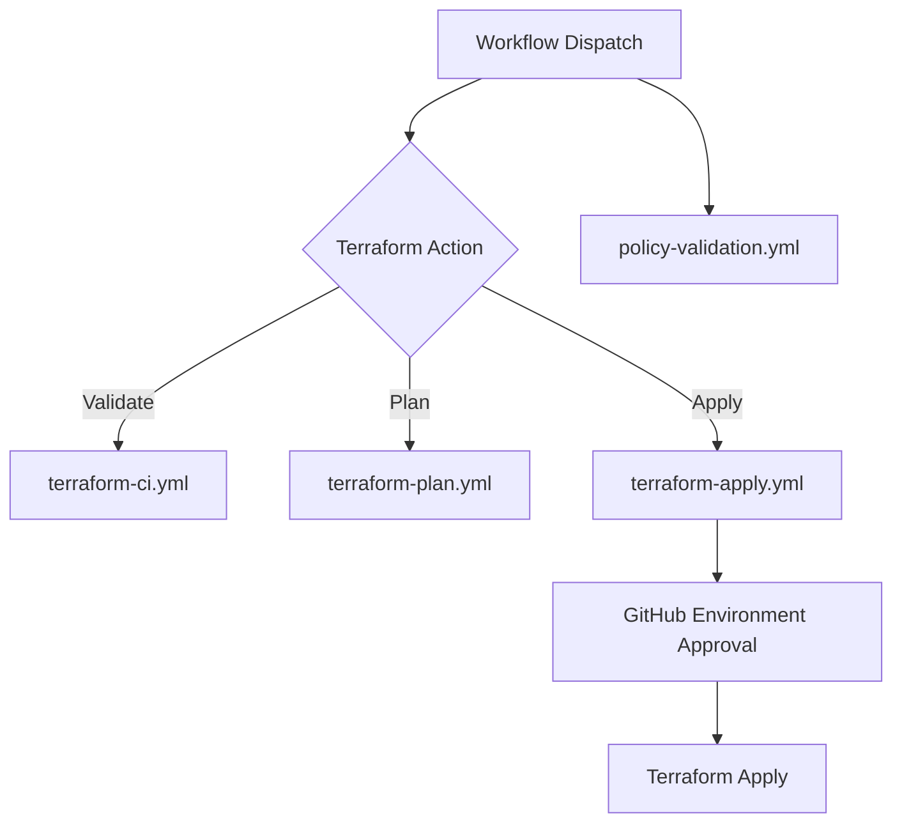

# Terraform GitHub Actions Orchestration

## Workflow Execution Flow

## OIDC Federation (No Client Secrets)
- Configure Entra ID app + Federated Credential for GitHub repo/branch/environment claims.
- Store only `AZURE_CLIENT_ID` and `AZURE_TENANT_ID` as repo/environment secrets (subscription passed as input).
- Use `azure/login@v2` with `id-token: write` permissions.

Benefits:
- Short-lived credentials
- No long-lived client secret rotation burden
- Better blast-radius control and auditability

## Design Notes
- Centralized `terraform-dispatch.yml` gives one operator entrypoint.
- Reusable workflows (`workflow_call`) reduce duplication and separate CI/Plan/Apply concerns.
- Apply uses GitHub Environments for approval gates.
