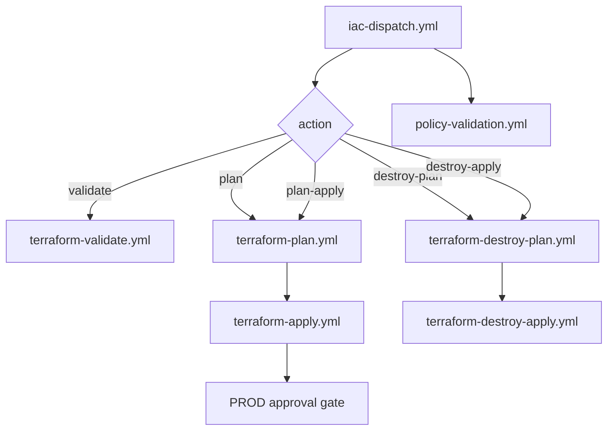

# Terraform Azure Platform (Enterprise Blueprint)

## Architecture Overview
This platform provisions Azure infrastructure with reusable modules for VNET, VM, Storage, and Governance across `DEV`, `UAT`, and `PROD`.

## Repository Structure
- `modules/vnet`: enterprise networking module (subnets, NSG, delegations, lifecycle)
- `modules/vm`: Linux VM module with for_each and optional PIP
- `modules/storage`: Storage account + container module
- `modules/governance`: policy set + assignment
- `environments/dev|uat|prod`: isolated composition per environment
- `.github/workflows`: reusable CI/CD orchestration
- `governance/`: policy JSON definitions
- `tests/`: Terratest examples

## CIDR and Segmentation Strategy
- DEV: `10.10.0.0/16`
- UAT: `10.15.0.0/16`
- PROD: `10.20.0.0/16`

Subnets:
- management-subnet
- application-subnet
- data-subnet
- private-endpoint-subnet
- future-reserved-subnet

Non-overlapping ranges support hybrid connectivity, peering growth, and future expansion.

## Naming and Tags
Naming is centralized in environment locals:
- `rg-opella-<env>-eastus`
- `vnet-opella-<env>-eastus`
- `vm-opella-<env>-eastus-001`

Mandatory tags applied with `merge()`:
`Environment, Project, ManagedBy, Owner, CostCenter, Region, Application`.

## Terraform Patterns Used
- `locals`: naming, tags, CIDR plans
- `for_each`: subnets, NSGs, VMs, containers
- `dynamic`: subnet delegations, optional ddos plan
- `lifecycle`: `prevent_destroy`, `create_before_destroy`, `ignore_changes`
- `validation`: SSH key and address-space validations
- `conditional resources`: public IP only when requested
- `outputs`: module outputs for composition
- `depends_on`: governance assignment after RG creation

## Governance Strategy
Policies include:
- Require Tags
- Allowed Regions
- Deny Public IP

These are grouped in initiative: `Opella-Governance-Baseline` and assigned to RG scope.
Future OPA is intentionally a placeholder in workflow only.

## OIDC Setup (No Client Secret)
Required environment variables (GitHub Environments `DEV/UAT/PROD`):
- `AZURE_CLIENT_ID`
- `AZURE_TENANT_ID`
- `AZURE_SUBSCRIPTION_ID`

Required environment secrets:
- `TF_BACKEND_RESOURCE_GROUP`
- `TF_BACKEND_STORAGE_ACCOUNT`
- `TF_BACKEND_CONTAINER`
- `TF_BACKEND_KEY`
- `WIZ_CLIENT_ID`
- `WIZ_CLIENT_SECRET`
- `EXTRA_ARGS`

`azure/login@v2` exchanges GitHub OIDC token for Azure access token, avoiding long-lived client secrets.

## Backend Strategy
`backend "azurerm" {}` is defined in each environment.
Runtime backend settings come from GitHub environment secrets via workflow `terraform init -backend-config=...`.

## Deployment Steps
1. Configure GitHub environments: `DEV`, `UAT`, `PROD`.
2. Add variables/secrets above.
3. Run `iac-dispatch` and choose action.
4. For PROD, enforce required reviewers in GitHub environment protection.

## Testing Strategy
Terratest validates vnet output availability and module wiring.

## Interview Talking Points
- Why OIDC over secrets (short-lived credentials, least secret sprawl)
- Why reusable workflows (`workflow_call`) for reduced duplication
- Why CIDR segmentation for hybrid readiness
- Why policy initiative for scalable governance
- Why lifecycle guards on critical resources
