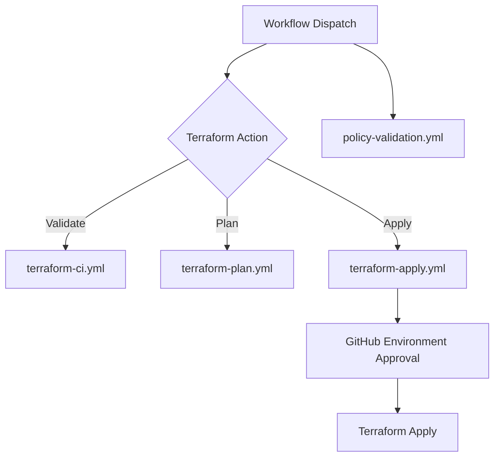

# Terraform GitHub Actions Orchestration

## Short Answer: Where is Client Secret used?
**Nowhere.** These workflows use **GitHub OIDC** with `azure/login@v2`, so there is no `ARM_CLIENT_SECRET` and no Azure client secret value passed to scripts. Authentication is done using a short-lived OIDC token exchanged by Azure Entra ID. 

## How Terraform connects to Azure in this repo
1. GitHub Actions job requests an OIDC token (`permissions: id-token: write`).
2. `azure/login@v2` exchanges that token with Azure Entra ID using:
   - `client-id` (`AZURE_CLIENT_ID`)
   - `tenant-id` (`AZURE_TENANT_ID`)
   - `subscription-id` (workflow input)
3. After login, Terraform uses the authenticated Azure session for `init/plan/apply`.

## Exactly what you must create (easy checklist)

### 1) Create GitHub Environments
Create these environments in your repo:
- `dev`
- `prod`

Path: **Repo → Settings → Environments**

### 2) Add Environment Secrets (for each environment)
Add these secrets in **both** `dev` and `prod`:
- `AZURE_CLIENT_ID` = Entra App (Service Principal) Application/Client ID
- `AZURE_TENANT_ID` = Entra Tenant ID

> `subscription_id` is intentionally passed as workflow input, not stored as a secret in current design.

### 3) Azure side: create app + federated credentials
In Azure Entra ID:
- Create/Register an application (or reuse existing SPN)
- Add **Federated credential** for GitHub Actions with your repo and branch/environment conditions
- Grant RBAC on target subscription/resource group (Contributor or scoped custom role)

### 4) Run the workflow
Use `terraform-dispatch` (or compatibility `workflow-dispatch`) and choose:
- `environment`: `dev` or `prod`
- `terraform_action`: `validate`, `plan`, or `apply`
- `subscription_id`: target subscription

## Required values reference

| Type | Name | Required | Where to set | Example |
|---|---|---:|---|---|
| Environment secret | `AZURE_CLIENT_ID` | Yes | GitHub Environment (`dev`,`prod`) | `11111111-2222-3333-4444-555555555555` |
| Environment secret | `AZURE_TENANT_ID` | Yes | GitHub Environment (`dev`,`prod`) | `aaaaaaaa-bbbb-cccc-dddd-eeeeeeeeeeee` |
| Workflow input | `subscription_id` | Yes | Run workflow form | `99999999-8888-7777-6666-555555555555` |
| Workflow input | `region` | Yes (defaulted) | Run workflow form | `eastus` |
| Workflow input | `terraform_version` | Yes (defaulted) | Run workflow form | `1.8.5` |
| Workflow input | `branch` | Yes (defaulted) | Run workflow form | `main` |

## Workflow Execution Flow

## OIDC Federation Benefits
- Short-lived credentials
- No long-lived client secret rotation
- Better auditability and reduced secret exposure

## Design Notes
- `terraform-dispatch.yml` is the primary operator entrypoint.
- Reusable workflows (`workflow_call`) reduce duplication.
- Apply flow uses GitHub Environments for approval gates.
